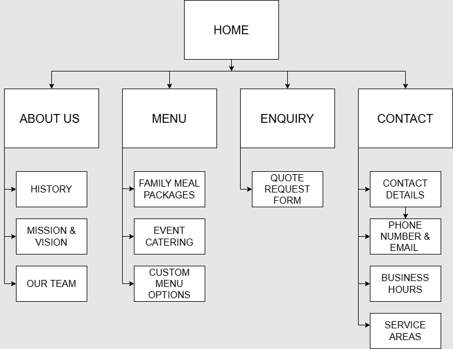

# Project Title
Buddy's Comfort Kitchen Catering Website

## Student Information
**Student number:** ST10532331  
**Student Name:** Botlhale Motshwanedi

## Project Overview

History: Established in 2019 by Buddy Smith, a passionate home cook who started   preparing meals for neighbours during lockdown. Now employs 6 family members and 3 part-time chefs, serving 160 weekly customers.  

Mission: “Delivering the warmth of home-cooked meals to busy families and events across our community” 

Vision: Becoming the leading home-based catering service in our community, expanding to corporate catering by 2026 

Target Audience: Busy professionals (aged 25 to 50), families with children, small event planners, and local offices. 

## Website Goals and Objectives
• Increase online orders by 40% within 5 months 
• Generate 20+ weekly enquiries via forms 
• Build email databases of 500 subscribers Year 1 
The main objectives include promoting the business, displaying the catering menu, allowing 
customers to contact the business for bookings, and increasing the number of catering 
orders. 

## Timeline and Milestones
The development of the website will follow a simple timeline. 
Week 1: Planning and gathering requirements. 
Week 2: Designing the layout and structure of the website. 
Week 3: Developing the website using HTML and CSS. 
Week 4: Testing the website and making final improvements before launching 

## Sitemap

## References
Coolors. (2024). Warm orange catering palette. Available at:  
Create a Palette - Coolors (Accessed: 11 April 2026) 
GitHub Pages. (2024). 
Free website hosting. Available at:  
https://pages.github.com (Accessed: 11 April 2026). 
Google Fonts. (2024). Playfair Display & Open Sans. Available at: 
https://fonts.google.com (Accessed: 11 April 2026) 
Krug, S. (2014) Don’t make me think: a common sense approach to 
web usability. 3rd ed. Berkeley: New Riders. 
Leaflet. (2024). Interactive maps JavaScript library. Available 
at:https://leaflet.js.com (Accessed: 11 April 2026) 
Niederst Robbins, J. (2018) Learning web design: a beginner’s 
guide to HTML, CSS, JavaScript and web graphics. 5th ed. Sebastopol: 
O’Reilly Media. 
Unsplash. (2024). Home catering kitchen images. Available at:  
https://unsplash.com/s/photos/home-catering (Accessed: 11 April 
2026)
Pexels. (2026). Home catering images. Available 
at:https://www.pexels.com/search/home%20catering/ (Accessed: 11 April 2026)
Canva.(2026).Free logo template : https://canva.com (Accessed: 11 April 2026)
Pexels.(2026). Roast meat dish :https://www.pexels.com/photo/choice-of-roasted-meat-15519314/ (Accessed: 18 April 2026)
Pexels.(2026). Catering photo :https://www.pexels.com/photo/colorful-buffet-table-with-assorted-dishes-33419115/ (Accessed:18 April 2026)
Pexels.(2026). Feast table:https://www.pexels.com/photo/delicious-middle-eastern-feast-table-spread-33580356/ (Accessed: 18 April 2026)
Pexels.(2026). Business woman:https://www.pexels.com/photo/confident-businesswoman-in-dark-blazer-portrait-37079370/ (Accessed: 18 April 2026)
Pexels.(2026). Samp and Beans dish :https://www.pexels.com/photo/traditional-burundian-bean-dish-on-green-background-37099771/ (Accessed :18 April 2026)
Unsplash.(2024). Grilled meat and vegetables:https://unsplash.com/photos/grilled-meat-and-vegetable-on-the-table-UC0HZdUitWY (Accessed: 18 April 2026)
Pexels.(2026). Brownies dessert:https://www.pexels.com/photo/brownie-on-plate-15033468/ (Accessed : 18 April 2026)
Pexels.(2026).Team :https://www.pexels.com/photo/man-in-black-crew-neck-shirt-beside-woman-in-black-crew-neck-shirt-6937472/ (Accessed: 18 April 2026)
Pexels.(2026). Kitchen staff :https://www.pexels.com/photo/women-in-kitchen-16866974/ (Accessed : 18 April 2026)
Draw.io. (2025): sitemap contruction
Pexels.(2026). Chef:https://www.pexels.com/photo/man-showing-bain-marie-in-hotel-restaurant-12020465/(Accessed :18 April 2026)
Unsplash.(2026). Lasagna dish :https://unsplash.com/photos/a-black-plate-topped-with-lasagna-covered-in-sauce-and-cheese-Tl6IYQse-tc (Accessed :18 April 2026)
Pexels. (2026). Beef stew pot :https://www.pexels.com/photo/a-baked-dish-in-a-pot-16699417/ (Accessed : 18 Aptil 2026)
Pexels. (2026). Buffet :https://www.pexels.com/photo/tacos-and-croissant-sandwiches-in-bakery-20219950/ (Accessed : 18 April 2026)
Unsplash. (2026). Family feast:https://unsplash.com/photos/white-plates-with-assorted-foods-Q_Moi2xjieU (Accessed : 18 A pril 2026)
Pexels.(2026). Catering :https://www.pexels.com/photo/people-standing-over-table-with-food-18749077/ (Accessed : 18 April 2026)
W3Schools tutorials.(2026). HTML structure and CSS layout techniques: https://www.w3schools.com/html/ (Accessed 17 April 2026)
